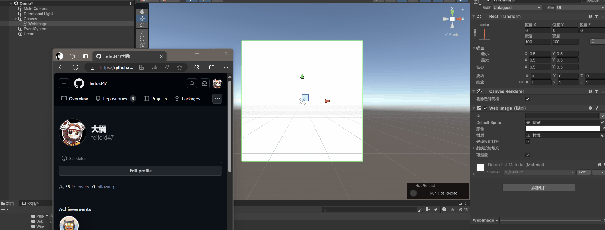
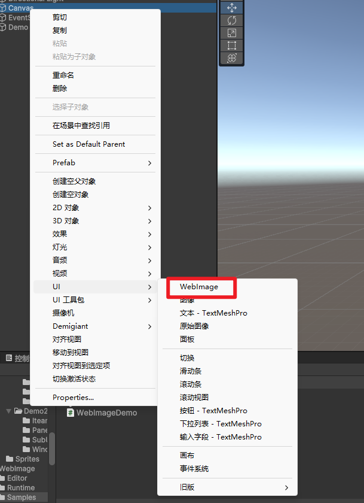
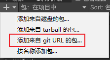

# 效果

  

右键快捷创建
  

# 特点

```
(1) 简单易用
(2) 支持异步
(3) 支持编辑器右键快捷创建 
(4) 可自定义实现下载过程
```

# 安装

## 方案一

使用git URL

```
https://github.com/feifeid47/Unity-WebImage.git
```


  

## 方案二

导入unitypackage

# 如何使用

```C#
using Feif.UI;
using System.Threading.Tasks;
using UnityEngine;

public class WebImageDemo : MonoBehaviour
{
    public WebImage img;
    public Sprite defaultSprite;

    void Start()
    {
        // 设置图片下载器。如果不设置，将会使用默认的图片下载器
        WebImage.Downloader = WebImageDownloader;
        // 图片下载成功回调
        img.OnDownloadSuccess += url =>
        {
            Debug.Log("下载完成");
        };
        // 图片下载失败回调
        img.OnDownloadFailed += url =>
        {
            Debug.Log("下载失败");
        };
        // 设置默认图片，下载失败将使用默认图片
        img.DefaultSprite = defaultSprite;
        // 设置图片地址
        img.SetUrl("https://avatars.githubusercontent.com/u/91374196?v=4");
    }

    public Task<Sprite> WebImageDownloader(string url)
    {
        // 在这里实现图片下载的过程
        // 如果有缓存需求，也是在这里实现
        return null;
    }
}
```
